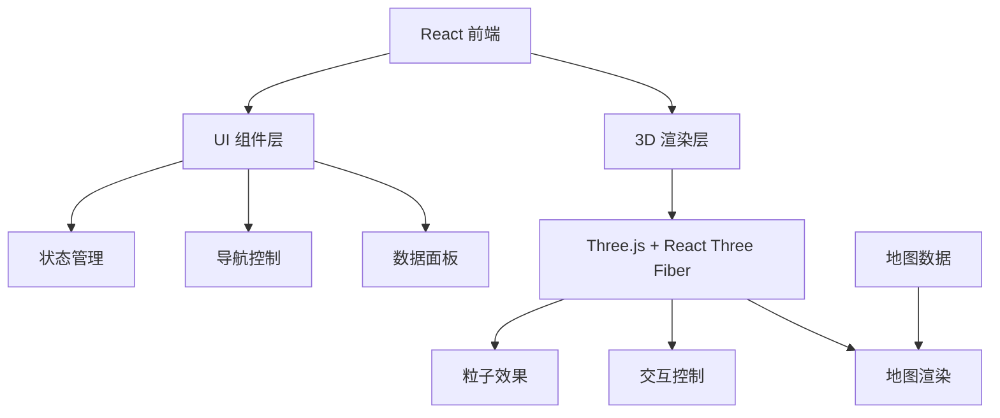

## 1. Architecture Design


## 2. Technology Description
- 前端：React@18 + TypeScript + Vite
- 3D 渲染：Three.js + @react-three/fiber + @react-three/drei
- CSS 框架：Tailwind CSS
- 状态管理：Zustand
- 地图数据：GeoJSON

## 3. Route Definitions
| Route | Purpose |
|-------|---------|
| / | 主页面，3D 地图大屏 |

## 4. Data Structure

### 4.1 地图层级状态
```typescript
interface MapLevel {
  level: 'country' | 'province' | 'city' | 'county';
  currentCode: string;
  name: string;
  parentCode?: string;
}
```

### 4.2 区域数据
```typescript
interface RegionData {
  code: string;
  name: string;
  children?: RegionData[];
  value: number;
  color: string;
}
```

### 4.3 统计数据
```typescript
interface StatsData {
  total: number;
  regions: number;
  avgValue: number;
  maxValue: { name: string; value: number };
}
```

## 5. Core Modules

### 5.1 3D 地图组件
- 使用 Three.js 渲染 3D 地图
- 支持 GeoJSON 数据解析
- 实现区域高亮和点击事件
- 集成 OrbitControls 实现拖拽、缩放、旋转

### 5.2 层级管理
- 维护当前地图层级状态
- 实现省→市→县下钻逻辑
- 处理返回上级功能

### 5.3 数据面板
- 显示当前层级统计数据
- 动态更新数据
- 响应式布局

### 5.4 粒子效果
- 背景星空粒子
- 区域发光效果
- 科技感动画

## 6. Performance Optimization
- 使用实例化渲染优化大量区域显示
- 按需加载地图数据
- 粒子系统使用 BufferGeometry
- 合理设置渲染帧率
