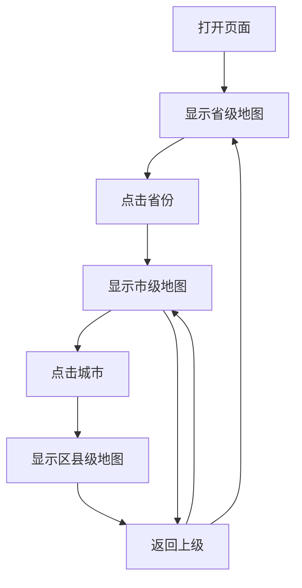

## 1. Product Overview
中国地图3D大屏数据可视化系统，支持省-市-县三级下钻，具备科技感视觉设计，支持拖拽、缩放交互。
- 为数据展示提供沉浸式3D地图体验，适用于大屏监控、数据展示等场景
- 支持实时数据更新和多级行政区域下钻查看

## 2. Core Features

### 2.1 Feature Module
1. **主页面**: 3D中国地图展示、数据面板、控制组件
2. **交互控制**: 拖拽平移、缩放、旋转视角
3. **层级下钻**: 省→市→县三级行政区域数据下钻查看
4. **数据展示**: 统计数据面板、区域高亮、动态效果

### 2.3 Page Details
| Page Name | Module Name | Feature description |
|-----------|-------------|---------------------|
| 主页面 | 3D地图展示 | 渲染3D中国地图，支持省市区县显示 |
| 主页面 | 交互控制 | 鼠标拖拽平移、滚轮缩放、右键旋转 |
| 主页面 | 层级下钻 | 点击省份进入市级视图，点击城市进入区县级视图 |
| 主页面 | 数据面板 | 显示当前层级统计数据，支持数据更新 |
| 主页面 | 导航控制 | 返回上级、重置视图、切换层级按钮 |

## 3. Core Process
用户打开页面→查看3D中国地图→点击省份下钻到市级→点击城市下钻到区县级→查看区域数据→通过导航返回上级。

## 4. User Interface Design
### 4.1 Design Style
- 主色调：科技蓝(#00d4ff)、深空灰(#0a0f1c)、霓虹紫(#a855f7)
- 视觉风格：科幻/赛博朋克风格，霓虹光效、网格背景、粒子效果
- 字体：科技感字体，使用 Orbitron 或类似字体
- 布局：全屏沉浸式布局，地图居中，数据面板悬浮
- 图标：科技风图标，简洁几何图形

### 4.2 Page Design Overview
| Page Name | Module Name | UI Elements |
|-----------|-------------|-------------|
| 主页面 | 3D地图 | 深蓝色背景，霓虹边框，悬浮粒子，发光区域高亮 |
| 主页面 | 数据面板 | 半透明玻璃态，霓虹边框，动态数字 |
| 主页面 | 控制按钮 | 圆角方形，悬浮光效，点击动画 |
| 主页面 | 导航栏 | 顶部悬浮，玻璃态背景，霓虹文字 |

### 4.3 Responsiveness
- 全屏响应式设计，适配不同尺寸大屏
- 支持 1920×1080、2560×1440、3840×2160 等常见分辨率
- 移动端简化交互，保留核心下钻和缩放功能

### 4.4 3D Scene Guidance
- 环境：深空背景，星星粒子效果
- 光照：蓝色主光源，紫色辅光源，区域发光效果
- 相机：初始俯视角，支持旋转、缩放、平移
- 交互：鼠标点击下钻，拖拽平移，滚轮缩放
- 动画：区域高亮脉冲效果，数据数字跳动，背景粒子流动
- 性能：使用 Three.js + React Three Fiber，优化渲染性能
